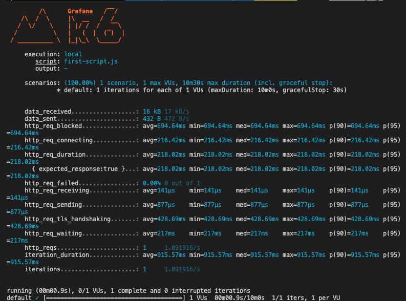
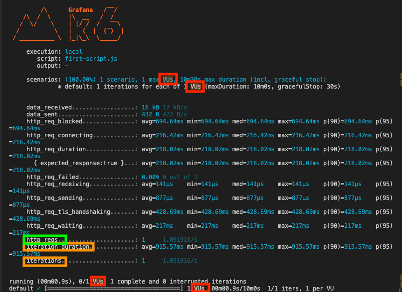
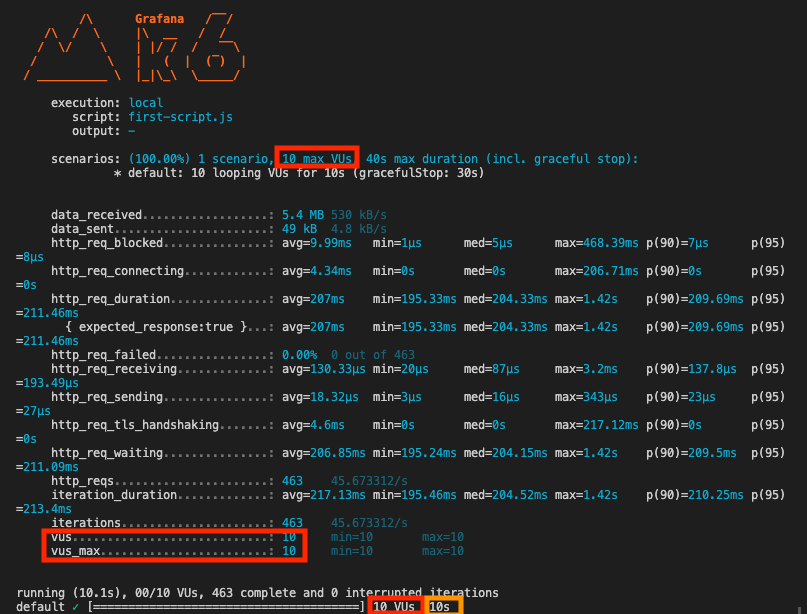
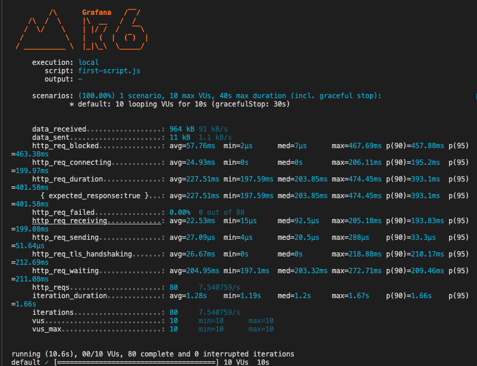
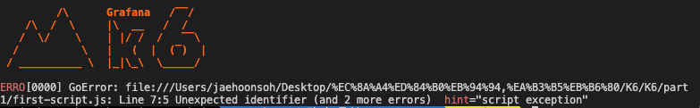
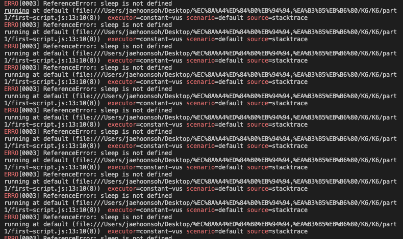
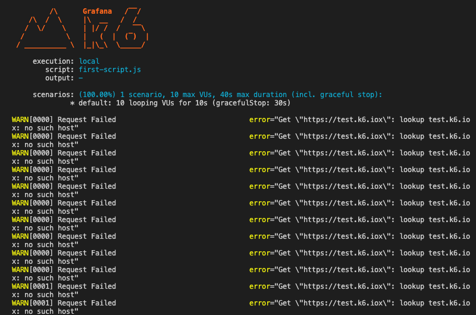
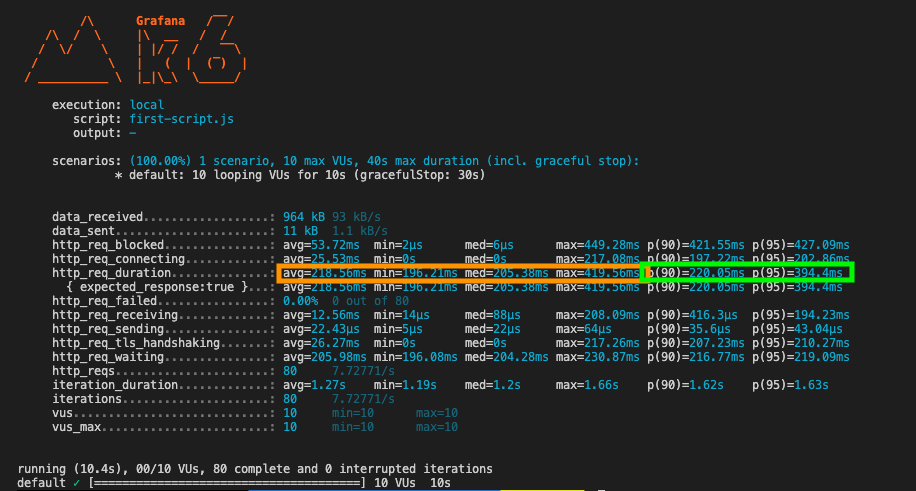

## K6 소개 및 기본 사용법

----

### 1.K6 소개

JMeter, Gatling, Locust와 같은 다양한 부하테스트가 존재하며, K6 또한 그라파나 소속의 부하테스트

K6는 JMeter, Gatling, Locust보다 성능이 더 빠르며 JS 기반의 부하 테스트 툴

- 프론트엔드 테스트, 백엔드 테스트 등 웹과 관련된 HTTP 프로토콜 및 API 테스트에서 주로 사용함
<br/>

### 2. K6 설치 및 테스트

[K6 공식문서 - 설치 가이드](https://grafana.com/docs/k6/latest/set-up/install-k6/)

- K6는 기본적으로 GUI를 제공하지 않으므로 터미널에서 설치 확인

```bash
k6 //k6 설치 확인
```

테스트 스크립트 작성
- test.k6.io : K6에서 제공 웹 사이트 주소
```javascript
import http from 'k6/http';

export default function (){
    http.get('https://test.k6.io'); //테스트 요청 사이트
}
```

테스트 실행
- 해당 스크립트 파일의 주소로 이동 한 후 터미널에서 스크립트 실행

```bash
k6 run 스트립트명.js
```

실행 결과


테스트 시 주의 사항
1. 일관성(Consistency) : 부하 테스트를 쉽게 재현하고 동일한 조건에서 동일한 결과를 얻어야 합니다.

2. 단독 트래픽(Sole Traffic): 어플리케이션이 다른 외부 데이터와 섞이지 않고 독립적으로 트래픽을 처리해야 합니다.

3. 방해 없음(No Disturbance): 사용자가 사용하고 있는 서버에 영향을 주지 않아야 합니다.

<br/>

### 3. 성능 테스트 개념 이해

Virtual Users (VUs)= 가상 사용자

Request(Req) = 요청

Latency = 지연 시간

Throughput = 처리량

Iterations = 반복(테스트 스크립트가 실행된 총 횟수)



테스트 스크립트 수정
```javascript
import http from 'k6/http';

//테스트 옵션 추가
export const options = {
    vus: 10, //가상 사용자
    duration: '10s' //테스트 시간
}

export default function (){
    http.get('https://test.k6.io'); //테스트 요청 사이트
}
```

출력 결과
- Iteration(총 테스트를 수)를 보면 설정한 사용자보다 더 많은 요청이 들어가고 나간 것을 확인할 수 있음
- Iteration = 가상 사용자가 실행한 테스트 스크립트의 반복 횟수를 나타냄
- VUs는 테스트 시간 동안 여러 번 반복적으로 요청을 보낼 수 있기때문에, 총 요청 횟수는 VUs보다 많아질 수 있음

-> 대기 시간을 설정함

- 단일 주소 호출 시, Iteration과 요청 수는 동일함



테스트 스크립트 수정
```javascript
import http from 'k6/http';
import { sleep } from 'k6';

//테스트 옵션 추가
export const options = {
    vus: 10, //가상 사용자
    duration: '10s' //테스트 시간

}

export default function (){
    http.get('https://test.k6.io'); //테스트 요청 사이트
    sleep(1); //대기시간
}
```

실행결과
- 대기 시간을 설정하여 총 요청 수와 반복 횟수가 줄어듬을 확인할 수 있음


<br/>

K6 테스트 에러

1. JS 스크립트 문법 오류
```javascript
import http from 'k6/http';
import { sleep } from 'k6';

//테스트 옵션 추가
export const options = {
    vus: 10 //가상 사용자 - JS 스크립트 문법 오류(쉼표 생략)
    duration: '10s' //테스트 시간

}

export default function (){
    http.get('https://test.k6.io'); //테스트 요청 사이트
    sleep(1);
}
```

실행 결과


2. 모듈 import 생략
```javascript
import http from 'k6/http';
//import { sleep } from 'k6'; //모듈 import 생략

//테스트 옵션 추가
export const options = {
    vus: 10, //가상 사용자
    duration: '10s' //테스트 시간

}

export default function (){
    http.get('https://test.k6.io'); //테스트 요청 사이트
    sleep(1);
}
```

실행 결과


3. 요청 URL 에러
```javascript
import http from 'k6/http';
import { sleep } from 'k6';

//테스트 옵션 추가
export const options = {
    vus: 10, //가상 사용자
    duration: '10s' //테스트 시간

}

export default function (){
    http.get('https://test.k6.iox'); //테스트 요청 사이트 에러
    sleep(1);
}
```




<br/>


### 4. 테스트 결과 및 메트릭 이해

avg = 평균, min = 최소, max = 최대

P(90) = 백분율 90%, P(95) = 백분율 95%
- 평균만으로 해당 프로그램의 요청 처리 시간을 판단하기에는 대기 그룹의 소요 시간을 신뢰할 수 없기에 백분율을 사용함

예시
- p(90): 요청의 90%가 220.05ms보다 빠름
- p(95): 요청의 95%가 394.4ms보다 빠름

p(90)=220.05ms p(95)=394.4ms 



K6의 결과 값만으로 어플리케이션의 요청 및 성능 측정 수준을 판단하기에는 어려움
- 때문에 Service-Level Object(SLO)(서비스 수준 목표)를 지정하여 테스트 목표치를 지정함

SLO(서비스 수준 목표)

예시
1. 가용성
    목표:
	• 정의: 애플리케이션이 사용 가능한 시간의 비율을 나타냅니다.
	• 목표: 애플리케이션은 전체 시간 중 99.8% 동안 사용 가능해야 합니다.

2. 응답 시간
	목표:
	• 90%의 요청은 0.5초 이내에 응답해야 합니다.
	• 95%의 요청은 0.9초 이내에 응답해야 합니다.
	• 99%의 요청은 2.5초 이내에 응답해야 합니다.

[SLA vs SLo vs SLI](https://www.atlassian.com/incident-management/kpis/sla-vs-slo-vs-sli)

<br/>