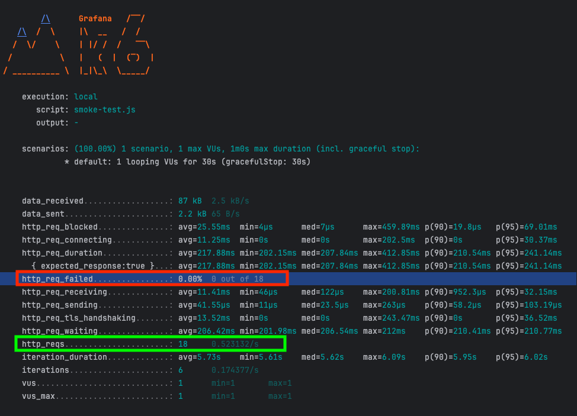
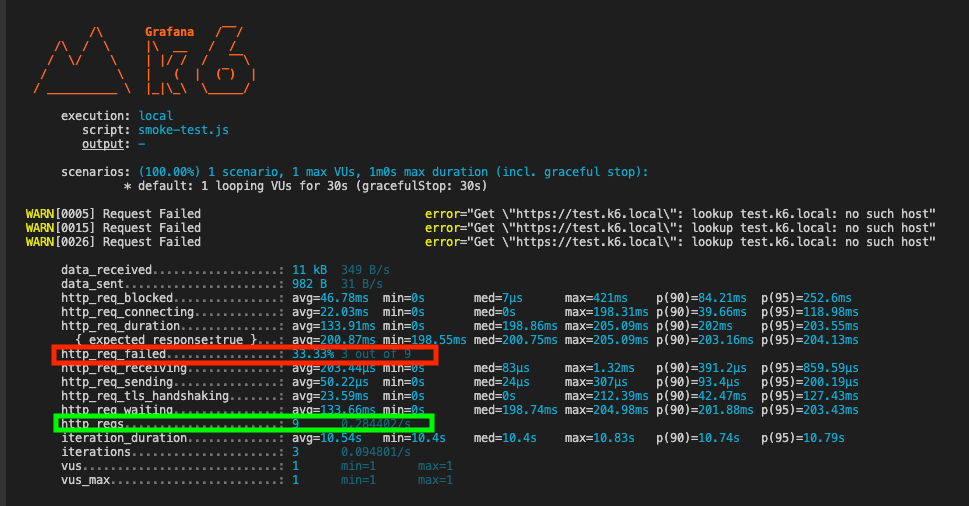
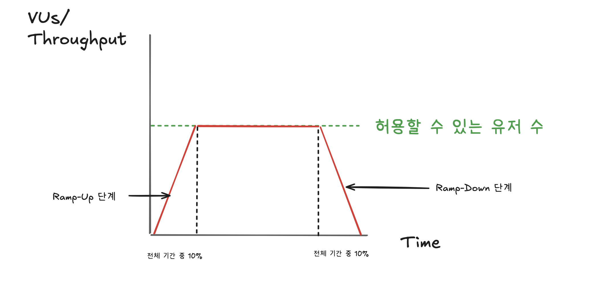
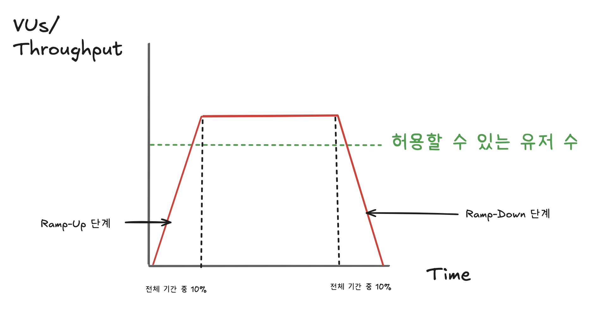
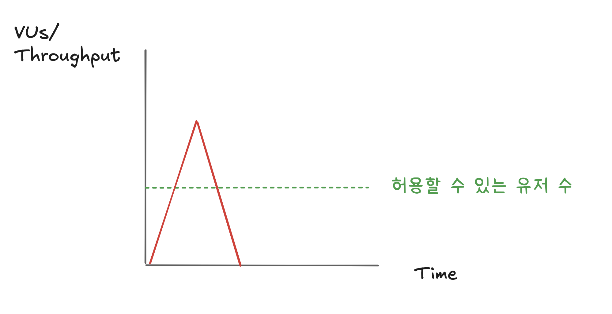
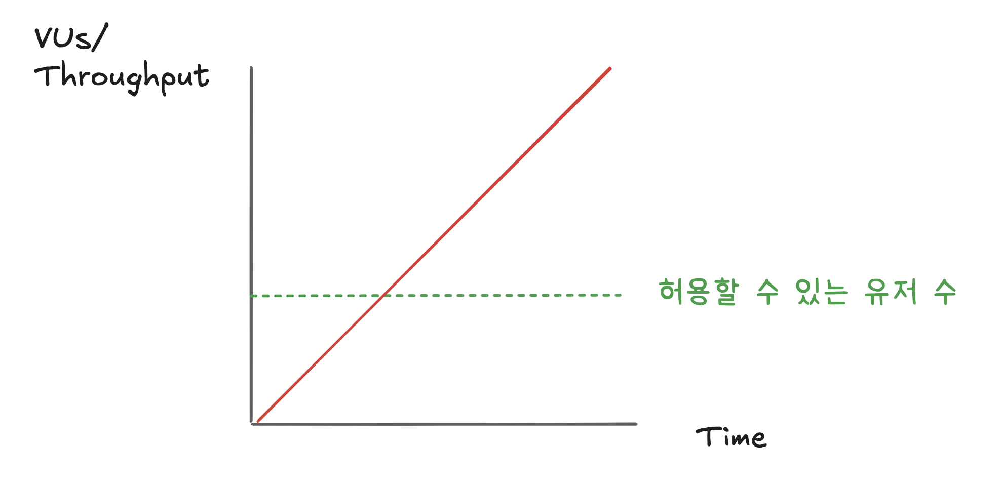
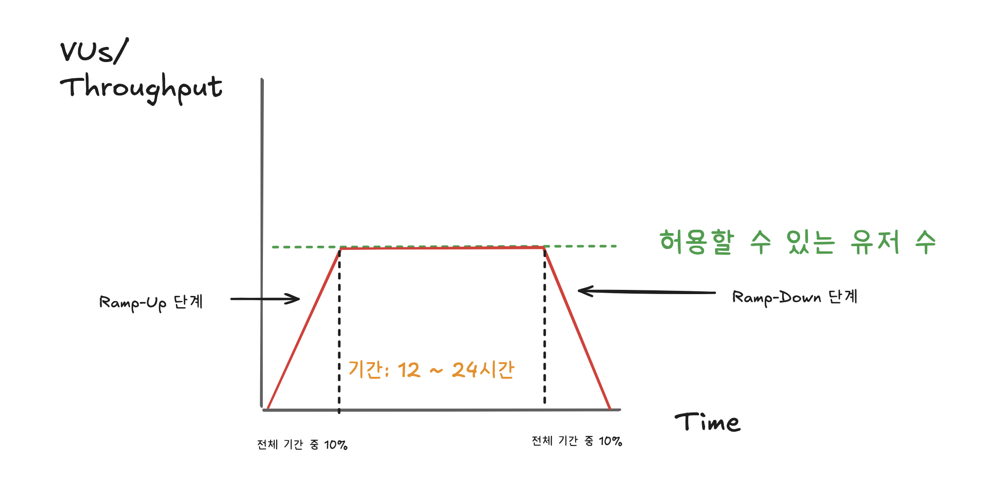

## K6가 수행할 수 있는 테스트 유형

---

K6에는 성능 테스트, 부하 테스트, 스트레스 테스트, 스파이크 테스트 등 다양한 테스트 종류들이 존재하며 서로 다른 테스트 간 유사점은 있지만 
테스트 유형마다 검사하는 목적과 항목들이 다름

테스트 시작 전 고려해야 할 점 
- 테스트를 통해 어떤 결과를 얻기 원하는가?

[공식문서 - K6 테스트 가이드](https://grafana.com/docs/k6/latest/testing-guides/)

<br/>

### 1. 성능 테스트

테스트 목적
- 사용자 관점: 시스템이 사용자 요구를 충족하고, 안정적으로 작동하는지 확인함
- 어플리케이션 요구사항 관점: 단일 테스트가 아닌 다양한 시나리오를 기반으로 성능 지표(응답 시간, 처리 속도 등)를 평가하여 요구사항 충족 여부를 검증함

성능 테스트의 실행 방식
- 단일 테스트가 아닌 다양한 유형의 테스트를 포함하여 수행
- 부하 테스트, 스트레스 테스트, 스파이크 테스트등을 포함한 개념
<br/>

#### 스케일링 개념

스케일 업(Scale Up)
- 수직적 확장
- 더 많은 RAM을 추가하거나 더 많은 코어를 가진 CPU로 교체 
- 물리적인 한계가 있으며, 추가되는 비용이 많이 들게 됨
- 순간적인 트래픽이 몰리는 경우를 제외하면 많은 리소스가 낭비되는 방식

스케일 아웃(Scale Out)
- 수평적 확장
- 동일한 조건의 서버를 여러 대 확장
- 클라우드 서비스에서 쉽게 서버를 확장 가능함
- 실제 사용한 리소스만큼만의 비용을 지불함

모놀리식 아키텍처
- 스케일 아웃이 상대적으로 어려움

MSA 아키텍처
- 스케일 아웃이 상대적으로 쉬움
<br/>

### 2. 스모크 테스트

테스트 목적
- 빌드 검증 테스트(Build Verification Test)라고 하며 SW 개발 과정에서 반복적으로 수행됨
- 작성한 테스트 스크립트와 응용 프로그램 간의 주요 기능이 정산적으로 작동하는지 확인함
- 초기 단계에서 수행되는 간단한 테스트로, 어플리케이션이 더 복잡한 테스트를 진행핧 준비가 되었는지 판단함
- 가장 작은 단위의 테스트로, 가상 사용자 한 명을 설정하여 응용 프로그램의 기본적인 응답 여부를 확인함
- Smoke 테스트는 성능 테스트가 아님

Smoke 테스트 특징
- 임시 테스트: 소프트웨어 빌드가 기본적인 안정성을 갖추었는지 확인하기 위해 수행됨
- 주요 기능 검증: 세부적인 오류를 찾기보다는 주요 기능이 제대로 작동하는지 빠르게 판단함


Smoke 테스트 결과 처리
통과 시
- 더 많은 테스트(기능 테스트, 성능 테스트 등)를 실행할 준비가 완료되었음을 의미함 

실패 시 
- 해당 어플리케이션은 즉시 해결해야 하는 심각한 문제를 포함하고 있음
- 문제 해결 후 다시 빌드 및 스모크 테스트를 실행해야 함

스크립트
- smoke-test.js
```JavaScript
import http from 'k6/http';
import { sleep } from 'k6';

//테스트 옵션 추가
export const options = {
    vus: 1, //가상 사용자
    duration: '30s' //테스트 시간

}

export default function (){
    http.get('https://test.k6.io'); //테스트 요청 사이트
    sleep(1);
    http.get('https://test.k6.io/contacts.php');
    sleep(2);
    http.get('https://test.k6.io/news.php');
    sleep(2);
}
```

실행
```bash
k6 run smoke-test.js
```

실행 결과
- ✅ : 실패한 경우
- ❎ : 성공한 경우

성공 예시

<br/>

실패 예시
- 서버가 404번 에러를 보냄
```javascript
import http from 'k6/http';
import { sleep } from 'k6';

//테스트 옵션 추가
export const options = {
    vus: 1, //가상 사용자
    duration: '30s' //테스트 시간

}

export default function (){
    http.get('https://test.k6.local');
    sleep(1);
    http.get('https://test.k6.io/contacts.php');
    sleep(2);
    http.get('https://test.k6.io/news.php');
    sleep(2);
}
```

실행 결과



### 3. 부하 테스트

테스트 목적
- 트래픽이 몰리는 순간적인 순간, 어플리케이션이 해당 요청을 처리할 수 있는지 확인하는 테스트
- 시스템의 성능과 안정성을 평가하여 예상되는 사용자 부하를 견딜 수 있는지 검증

부하 테스트 특징
- 짧은 기간 내 테스트를 하는 것은 비추천, 충분한 시간을 확보하여 결과를 분석해야 함
- 처음 테스트 설계 시 점차적인 사용자 증가시키는 방식으로 진행해야 함
- 실제 환경을 최대한 반영하여 테스트를 수행함으로써 신뢰도 높은 결과를 얻을 수 있음

부하 테스트 단계
1. Ramp-up 단계
- 사용자 수를 점진적으로 늘리는 초기 단계
- 애플리케이션이 증가하는 트래픽에 적응할 수 있는지 확인
- 전체 부하 테스트 기간의 약 **10%**를 차지하며, 안정적인 시작을 보장

2. 부하 테스트 유지 단계
- 순간적으로 몰리는 트래픽을 일정 시간 동안 유지하는 중기 단계
- 애플리케이션이 지속적인 높은 부하에서도 성능 저하 없이 작동하는지 평가
- 해당 단계에서 주요 성능 지표(응답 시간, 처리량 등)를 집중적으로 모니터링

3. Ramp-down 단계
- 트래픽이 감소하고 사용자가 줄어드는 후기 단계.
- 애플리케이션이 정상 상태로 복귀하는 과정을 확인하며, 리소스 해제 및 안정성을 평가.
- 전체 부하 테스트 기간의 약 **10%**를 차지하며, 종료 시점의 상태를 분석.




부하 테스트 시 주의 사항
- 테스트 환경은 실제 운영 환경과 최대한 유사해야 함(네트워크 속도, 서버 구성 등)
- 예상되는 최대 사용자 수와 트래픽 패턴을 기반으로 시나리오를 설계해야 함
- 결과 분석 시 병목 현상과 성능 저하 원인을 파악하고, 최적화 방안을 제시해야 함

스크립트
load-test.js
```javascript
import http from 'k6/http';
import { sleep } from 'k6';

export const options = {
    stages: [
        {
            duration: '10s',
            target: 10
        },
        {
            duration: '30s',
            target: 10
        },
        {
            duration: '10s',
            target: 0
        }
    ]
}

export default function () {
    http.get('https://test.k6.io');
    sleep(1);
    http.get('https://test.k6.io/contact.php');
    sleep(2);
    http.get('https://test.k6.io/news.php');
    sleep(2);
}
```

실행
```bash
k6 run load-test.js
```
<br/>

### 4. 스트레스 테스트

테스트 목적
- 극한 조건에서 어떻게 작동하는지 평가하여 성능 병목 현상, 안정성, 확장성, 잠재적 취약점을 식별
- 예상치 못한 높은 부하나 제한된 리소스 환경에서 시스템의 견고함을 확인하고 최대 한계를 파악함

스트레스 테스트 특징
- 정상적인 작동 범위를 넘어서는 극단적인 시나리오를 시뮬레이션하여 시스템의 안정성을 검증함
- 과도한 사용자 로드, 제한된 리소스, 과도한 데이터 입력 등 다양한 조건을 적용함
- 성능 저하, 메모리 누수, 충돌 등의 문제를 발견하여 개선 사항을 제시함
- 시스템이 스트레스 상태에서도 적절한 오류 메시지를 제공하는지 확인함

스트레스 테스트 단계
1.	Ramp-up 단계
- 사용자 수를 점진적으로 늘리는 초기 단계
- 애플리케이션이 증가하는 트래픽에 적응할 수 있는지 확인
- 극한 부하를 가하기 전, 시스템이 정상적으로 작동하는지 확인하며 안정적인 시작을 보장함
- 전체 스트레스 테스트 기간의 약 **10%**를 차지.

2.	스트레스 유지 단계
- 예상치를 초과하는 극단적인 트래픽을 일정 시간 동안 유지하는 중기 단계
- 애플리케이션이 극한 부하에서도 성능 저하 없이 작동하는지 평가함
- 해당 단계에서 주요 성능 지표(응답 시간, 처리량, 오류율 등)를 집중적으로 모니터링하여 병목 현상이나 시스템 한계를 식별함

3.	Ramp-down 단계
- 트래픽을 점진적으로 줄이며 사용자가 감소하는 후기 단계
- 애플리케이션이 정상 상태로 복귀하는 과정을 확인하며, 리소스 해제 및 안정성을 평가함
- 전체 스트레스 테스트 기간의 약 **10%**를 차지하며, 종료 시점의 상태를 분석함



스트레스 테스트 시 주의 사항
- 실제 운영 환경과 유사한 조건에서 테스트를 수행해야 신뢰도 높은 결과를 얻을 수 있음
- 극단적인 조건을 설정하되, 현실적인 시나리오를 반영하여 실질적인 개선 방향을 도출해야 함
- 테스트 중 발생하는 오류와 병목 현상을 기록하고 적절히 대응할 수 있는 계획을 마련해야 함

스크립트
- stress-test.js
```JavaScript
import http from 'k6/http';
import { sleep } from 'k6';

//테스트 옵션 추가
export const options = {
    stages: [
        {
            duration: '10s',
            target: 10
        },
        {
            duration: '30s',
            target: 10
        },
        {
            duration: '10s',
            target: 0
        }
    ]
}

export default function (){
    http.get('https://test.k6.io'); //테스트 요청 사이트
    sleep(1);
    http.get('https://test.k6.io/contacts.php');
    sleep(2);
    http.get('https://test.k6.io/news.php');
    sleep(2);
}
```

실행
```bash
k6 run stress-test.js
```
<br/>

### 5. 스파이크 테스트

테스트 목적
- 사용자가 급격히 늘어나는 상황에서 어플리케이션이 어떻게 반응하는지 평가
- 갑작스러운 트래픽 증가 및 감소 시 시스템의 안정성과 복구 능력을 확인
- 예상치 못한 부하 상황에서 성능 저하, 오류 발생 여부, 복구 시간을 측정

스파이크 테스트 특징
- 짦은 기간동안 급격히 높은 부하를 가하고, 이후 빠르게 부하를 감소시키는 방식으로 수행
- 시스템의 한계와 병목 현상을 식별하고, 극단적인 상황에서의 안정성을 검증함
- 일반적인 테스트보다 부하의 변화 폭이 크며, 매우 짧은 시간 내에 실행됨
- 특정 이벤트(마케팅 캠패인, 플래시 세일)로 인해 발생할 수 있는 트래픽 급증 상황을 시뮬레이션




스파이크 테스트 시 주의 사항
- 테스트 환경은 실제 운영 환경과 최대한 유사하게 구성해야 함
- 갑작스러운 트래픽 증가로 인한 시스템 장애가 발생할 가능성을 미리 고려해야 함
- 자동 스케일링 기능이 활성화된 환경에서는 결과가 왜곡될 수 있으므로 주의가 필요함
- 복구 시간과 성능 저하 원인을 분석하여 개선 방안을 마련해야 함

스크립트
- spike-test.js
```JavaScript
import http from 'k6/http';
import { sleep } from 'k6';

//테스트 옵션 추가
export const options = {
    stages: [
        {
            duration: '2m',
            target: 10000
        },
        {
            duration: '1m',
            target: 0
        }
    ]
}

export default function (){
    http.get('https://test.k6.io'); //테스트 요청 사이트
    sleep(1);
}
```

실행
```bash
k6 run spike-test.js
```
<br/>

### 6. 엔드 투 엔드 테스트

테스트 목적
- 어플리케이션의 최대 용량을 파악하고, 점진적으로 트래픽을 높이며 시스템이 전체적으로 작동한는지 확인함
- 사용자 관점에서 어플리케이션의 모든 기능과 워크플로를 검증하여 실제 환경에서 예상대로 작동하는지 평가함
- 통합된 모든 구성 요소(DB, API, 외부 시스템 등)가 원활하게 작동하는지 확인함




엔드 투 엔드 테스트의 특징
- 전체 시스템 검증: 특정 모듈이 아닌, 어플리케이션의 전체 흐름과 통합된 시스템을 테스트함
- 실제 시나리오 기반: 사용자가 실제로 수행할 작업을 시뮬레이션하여 테스트 사례를 설계함
- 광범위한 테스트 범위: 사용자 로그인, 데이터 처리, 외부 시스템 통합 등 다양한 구성 요소를 포함함
- 포괄적인 오류 탐지: 단순한 기능적 오류뿐만 아닌 통합 문제와 데이터 무결성 문제도 식별 가능함
- 복잡성 증가: 설정 및 실행에 시간이 많이 소요되며, 다른 테스트보다 복잡한 프로세스 요구

엔드 투 엔드 테스트 단계
1. 테스트 계획 수립
- 전체 시스템 흐름을 분석하고 주요 사용자 시나리오를 정의함
- 필요한 테스트 환경 및 데이터를 준비함

2. 테스트 환경 설정
- 실제 운영 환경과 유사한 환경을 구축함(서버, 네트워크, DB 등)

3. 테스트 실행
- 사용자의 실제 동작을 기반으로 한 시나리오를 실행하며, 각 단계에서 결과를 기록함

4. 결과 분석 및 보고
- 수집된 데이터를 분석하여 오류 및 병목 현상을 식별하고 개선 방향을 제시함

엔드 투 엔드 테스트 시 주의 사항
- 실제 환경 시뮬레이션: 운영 환경과 최대한 유사하게 설정하여 신뢰도 높은 결과를 얻어야 함
- 테스트 데이터 관리: 민감한 데이터를 사용할 경우 보안에 우의하며, 충분히 다양한 데이터를 준비, 관리해야 함
- 자동화 도구 활용 가능: Jenkins와 Cypress등 자동화 도구를 사용하여 효율성을 높임
- 테스트 범위 제한: 지나치게 광범위한 테스트는 비효율적일 수 있으므로 주요 사용자 흐름에 초점을 맞춤

스크립트
- breakpoint-test.js
```JavaScript
import http from 'k6/http';
import { sleep } from 'k6';

//테스트 옵션 추가
export const options = {
    stages: [
        {
            duration: '2h',
            target: 10000
        }
    ]
}

export default function (){
    http.get('https://test.k6.io'); //테스트 요청 사이트
    sleep(1);
}
```

실행
```bash
k6 run breakpoint-test.js
```
<br/>

### 7. 장시간 부하 테스트(Soak Test)

테스트 목적
- 부하 테스트의 시간을 늘려 장시간 동안 시스템이 안정적으로 작동하는지 평가함
- 메모리 누수, 성능 저하, 리소스 고갈 등 장기적인 문제를 식별하여 시스템의 지속 가능성을 검증함
- 예상되는 사용자 수와 트래픽 조건에서 시스템이 오랜 시간동안 정상적으로 작동할 수 있는지 확인함

Soak 테스트 특징
- 장시간 실행: 짧은 시간의 부하 테스트와 달리, 12시간 ~ 24시간, 수 시간 등 며칠 동안 지속적으로 수행됨
- 리소스 사용 분석: CPU, 메모리, 네트워크 등의 리소스가 시간이 지남에 따라 어떻게 변화하는지 모니터링함
- 장기적 안정성 평가: 시스템이 지속적으로 높은 부하를 견딜 수 있는지 확인하며, 메모리 누수나 성능 저하를 발견함
- 실제 운영 환경 반영: 예상되는 사용자 수준과 트래픽 패턴을 기반으로 테스트를 설계하여 현실적인 결과를 도출함




Soak 테스트 시 주의 사항
- 테스트 환경 구성: 실제 운영 환경과 최대한 유사하게 설정하여 신뢰도 높은 결과를 확보해야 함
- 높은 시간 확보: 테스트는 최소 몇 시간에서 며칠동안 진행되어야 하며, 시간 부족은 정확한 결과 도출을 방해할 수 있음
- 데이터 분석 도구 활용: 자동화된 모니터링 도구를 사용하여 실시간으로 데이터를 수집하고 분석해야 함
- 장기적 문제 발견에 집중: 단기적인 성능 저하보다 메모리 누수나 리소스 고갈 등 장기적 문제에 초점을 맞춤

스크립트
- soak-test.js
```JavaScript
import http from 'k6/http';
import { sleep } from 'k6';

//테스트 옵션 추가
export const options = {
    stages: [
        {
            duration: '5m',
            target: 1000
        },
        {
            duration: '24h',
            target: 1000
        },
        {
            duration: '50s',
            target: 0
        }
    ]
}

export default function (){
    http.get('https://test.k6.io'); //테스트 요청 사이트
    sleep(1);
}
```

실행
```bash
k6 run soak-test.js
```